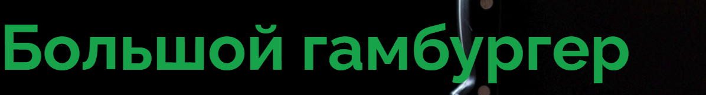

# Burger App 🍔

A bold, playful burger restaurant website built with React 19, Vite, Tailwind CSS v4, and custom CSS animations. Features a striking red/orange/cream brand palette, custom cursor, magnetic interactions, and scroll-driven reveals.

## 🎨 Brand Identity

### Color Palette
| Color | Hex | CSS Variable | Usage |
|-------|-----|--------------|-------|
| **Brand Red** | `#c8151b` | `--color-brand-red` | Primary CTAs, hero background |
| **Brand Red Deep** | `#a30f14` | `--color-brand-red-deep` | Hover states |
| **Brand Orange** | `#f26a1b` | `--color-brand-orange` | Accents, gradients |
| **Brand Orange Deep** | `#dd5510` | `--color-brand-orange-deep` | Hover accents |
| **Brand Yellow** | `#f9b300` | `--color-brand-yellow` | Highlights, badges |
| **Brand Cream** | `#fff6e9` | `--color-brand-cream` | Page background |
| **Brand Sand** | `#f7e4c6` | `--color-brand-sand` | Section backgrounds |
| **Brand Ink** | `#2a1a14` | `--color-brand-ink` | Primary text |
| **Brand Muted** | `#6f625b` | `--color-brand-muted` | Secondary text |

### Logo / Wordmark
- **Display Font**: "Luckiest Guy" (Google Fonts) — bold, playful, all-caps
- **Body Font**: "Poppins" — clean, readable sans-serif
- Used in Header, Hero, and Footer

### Visual Style
- **Food Cutout Images**: Foreground-only photos with drop shadows (no blend modes)
- **Dashed Icon Tiles**: Red dashed-border icon containers
- **Ticket-Clip Buttons**: Notched pill buttons with shine sweep animation
- **Outline Text**: Red-stroke transparent text for marquee headlines

---

## ✨ Key Features

| Feature | Description |
|---------|-------------|
| **Custom Cursor** | Dot + ring with hover/active states |
| **Preloader** | Bouncing burger loader with progress bar |
| **ScrollFx** | Scroll-driven zoom, draw, spin, rise animations |
| **Magnetic Buttons** | Cursor-attracting CTA buttons |
| **Split Text** | Per-character stagger reveal with jelly hover |
| **Parallax Depth** | Mouse-following and scroll-linked layer movement |
| **Floating Particles** | CSS-animated decorative elements |
| **Steam Effect** | Animated steam on food images |
| **Click Burst** | Particle explosion on magnetic button clicks |
| **Marquee** | Infinite scrolling outline-text banner |
| **Reveal System** | 7 scroll-triggered entrance animations |

---

## 📸 Hero Section (Live Deployment)


*Hero: "Большой гамбургер" / "ГОВЯДИНА" (Big Burger / Beef in Russian), sampled red background from hero burger photo, floating burger cutout with drop shadow, magnetic "Order Now" button with shine sweep, scroll indicator*

---

## 🛠 Tech Stack

```
React 19.2.6          │  Framer Motion (via components)
Vite 7.3.2            │  Tailwind CSS 4.1.17
TypeScript 5.9.3      │  Lucide React
vite-plugin-singlefile│  clsx + tailwind-merge
```

---

## 🚀 Getting Started

```bash
# Install dependencies
npm install

# Development server
npm run dev

# Production build
npm run build

# Preview build
npm run preview
```

---

## 📁 Project Structure

```
burger-app/
├── public/
├── src/
│   ├── assets/           # Food photography (hero, dishes, chefs)
│   ├── components/
│   │   ├── decor/        # Doodles, decorative elements
│   │   ├── fx/           # Cursor, Preloader, Particles, ScrollFx, etc.
│   │   ├── ui/           # FoodCutout, Logo, Reveal, SectionTag
│   │   ├── About.tsx
│   │   ├── Chefs.tsx
│   │   ├── Footer.tsx
│   │   ├── Header.tsx
│   │   ├── Hero.tsx
│   │   ├── MenuList.tsx
│   │   ├── Newsletter.tsx
│   │   ├── PopularDishes.tsx
│   │   ├── Stats.tsx
│   │   ├── Testimonials.tsx
│   │   └── WhyChooseUs.tsx
│   ├── hooks/
│   │   ├── useMagnetic.ts
│   │   ├── useReveal.ts
│   │   └── useSampledColor.ts
│   ├── utils/
│   │   └── cn.ts
│   ├── App.tsx           # Main app (54 lines - composition root)
│   ├── index.css         # Complete design system (473 lines)
│   ├── main.tsx
│   └── vite-env.d.ts
├── index.html
├── package.json
├── tsconfig.json
└── vite.config.ts
```

---

## 🎯 Design System (from `index.css`)

### Animation Keyframes
- `float` / `float-slow` — Gentle vertical bob
- `spin-slow` — Continuous rotation
- `marquee` — Infinite horizontal scroll
- `wiggle` — Rotation oscillation
- `drift` / `bob` — Combined translate+rotate
- `pulseRing` — Expanding ring shadow
- `fadeSlide` — Entrance transition
- `jelly` — Squash/stretch character animation
- `burst` — Click particle explosion
- `particle` — Floating decorative motion
- `shine` — Button sweep highlight
- `loaderBounce` / `loaderBar` — Preloader
- `ripple` — Touch ripple effect
- `steam` — Rising steam animation

### Scroll-Driven Animations (Native)
- `sd-zoom` — Scale on scroll enter
- `sd-draw` — SVG stroke draw
- `sd-spin` — Rotation on scroll
- `sd-rise` — Vertical translation

### Component Classes
| Class | Purpose |
|-------|---------|
| `.display` | Luckiest Guy uppercase heading |
| `.text-outline-red` | Red stroke transparent text |
| `.food-cutout` | Foreground food image |
| `.food-cutout-shadow` | Drop shadow for cutouts |
| `.btn-red` | Primary pill button with shine |
| `.reveal` | Base scroll reveal |
| `.reveal[data-dir="..."]` | Directional variants |
| `.char` | Split text character |
| `.depth` / `.scroll-depth` | Parallax layers |
| `.particle` | Floating decorative |
| `.icon-tile` | Dashed border icon |
| `.shine-panel` | Sweep highlight panel |
| `.burst-dot` | Click particle |
| `.steam` | Steam animation |

---

## 🌐 Deployed

**Vercel**: https://burger-app-lubirges-projects.vercel.app

**GitHub**: https://github.com/lubirge777-star/burger-app

---

## 📄 License

MIT License - Built as a design showcase for a burger restaurant brand.